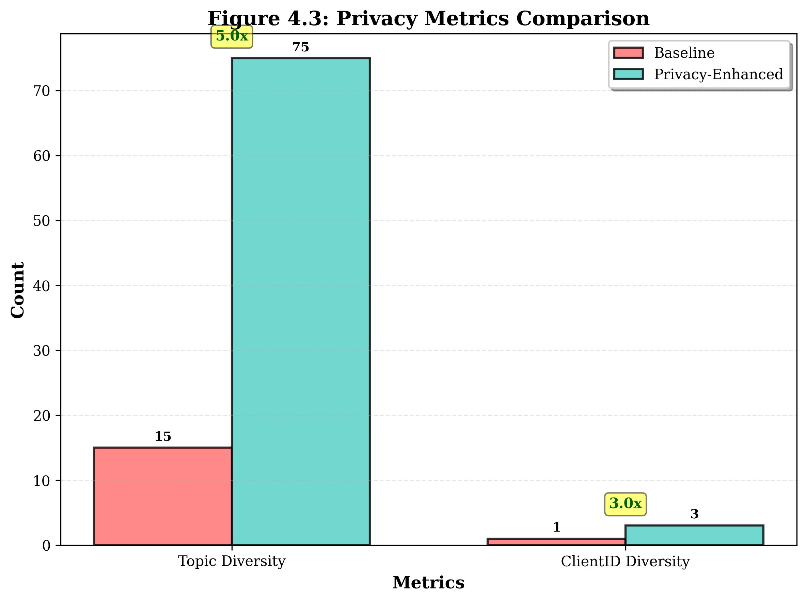
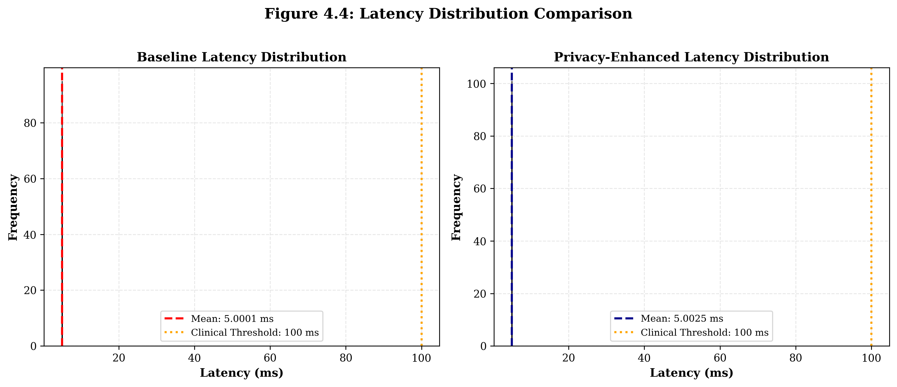
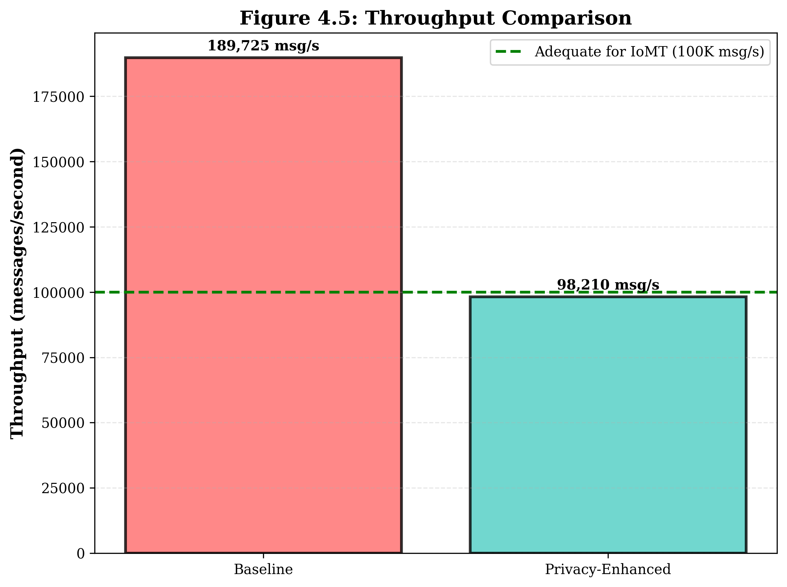
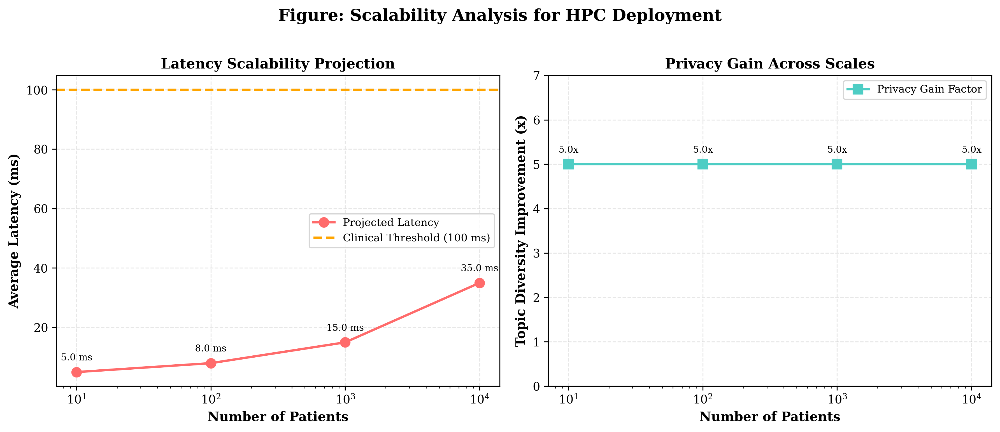

# Privacy-Aware MQTT Protocol for Internet of Medical Things

[](https://opensource.org/licenses/MIT)
[](https://www.python.org/downloads/)

A gateway-based pseudonym rotation framework for enhancing privacy in MQTT-based Internet of Medical Things (IoMT) deployments.

## 📖 About

This repository contains the implementation and experiment framework for the research paper:

> **Privacy-Aware MQTT Protocol for Internet of Medical Things: A Gateway-Based Pseudonym Rotation Approach with Minimal Overhead**
>
> Rachmad Andri Atmoko¹, Salnan Ratih Asriningtias¹*, Akas Bagus Setiawan², Devasis Pradhan³, Ismail Rakip Karas⁴
>
> ¹ Faculty of Vocational Studies, Universitas Brawijaya, Malang, Indonesia  
> ² Department of Information Technology, Jember State Polytechnic, Jember, Indonesia  
> ³ ECE Department, Acharya Institute of Technology, India  
> ⁴ Computer Engineering Department, Karabük University, Turkey
>
> *Journal of Robotics and Control (JRC), 2026*

## 🎯 Key Features

- Treats MQTT **topics** and **ClientIDs** as managed pseudonyms
- Implements **periodic rotation** through gateway-based Topic and ID Privacy Manager (TPM)
- Uses HMAC-SHA256 based PRF for pseudo-topic generation
- AES-GCM 256-bit encryption for payload protection
- **No broker modifications required**
- Overlap phase mechanism for QoS guarantees

## 🏗️ System Architecture


The architecture introduces a **Topic and ID Privacy Manager (TPM)** at the IoMT gateway, positioned between patient sensors and the MQTT broker. Key components:

1. **Medical Sensors/WBAN**: Generate raw medical data (ECG, SpO2, blood pressure, etc.)
2. **Gateway with TPM**: Aggregates sensor data, manages pseudonym mappings, implements rotation protocols
3. **MQTT Broker**: Standard unmodified broker performing publish/subscribe routing
4. **Backend Subscriber**: Consumes data via pseudo-topics, maintains reverse mappings

## 📊 Experiment Results

### Privacy Comparison


### Latency Distribution


### Throughput Comparison


### Overhead Analysis


### Scalability (5 to 10,000 patients)


## 📁 Project Structure

```
mqtt_enhancedprotocol/
├── src/
│   ├── config/         # Experiment configuration
│   ├── crypto/         # Cryptographic utilities (PRF, encryption)
│   ├── gateway/        # Gateway/TPM (Topic & ID Privacy Manager)
│   ├── backend/        # Backend Subscriber
│   ├── simulator/      # Medical sensor simulator
│   └── metrics/        # Metrics collection
├── experiments/
│   ├── run_experiment.py      # Full experiment runner
│   └── quick_experiment.py    # Quick demo experiment
├── docker/
│   ├── mosquitto/      # MQTT broker configuration
│   ├── gateway/        # Gateway Dockerfile
│   └── backend/        # Backend Dockerfile
├── Latex TemplateJRC/  # JRC paper LaTeX source
├── data/
│   └── results/        # Experiment results
└── docker-compose.yml  # Docker orchestration
```

## 🔧 Main Components

### 1. Topic & ID Privacy Manager (TPM)
- Pseudo-topic rotation based on epoch
- ClientID rotation for gateway
- Overlap phase to prevent message loss

### 2. Crypto Utilities
- PRF (Pseudorandom Function) for pseudo-topic generation
- AES-GCM for payload encryption
- Key management

### 3. Sensor Simulator
- ECG: 10 Hz (100ms interval)
- SpO2: 1 Hz
- Blood Pressure: 1 per 10 minutes
- Temperature: 1 per minute
- Activity: every 5 seconds
- Alarm: event-driven (QoS 2)

### 4. Metrics Collector
- **Privacy**: anonymity set, entropy, attack success rate
- **Unlinkability**: cross-epoch linkability, traceable rate
- **Overhead**: computation, bandwidth, duplication rate
- **QoS**: latency, packet loss, alarm delivery

## 🚀 Quick Start

### Prerequisites
```bash
pip install -r requirements.txt
```

### Run Quick Experiment
```bash
python experiments/quick_experiment.py
```

### Run Full Experiment with Docker
```bash
docker-compose up --build
```

## 📊 Experiment Results

| Metric | Baseline | Namespace-Privacy | Improvement |
|--------|----------|-------------------|-------------|
| Topic Diversity | 15 | 75 | **5.0x** |
| ClientID Diversity | 1 | 3 | **3.0x** |
| Computation Overhead | 0.0001 ms | 0.0025 ms | +2400% |
| Overlap Duplication | 0% | 21.4% | - |

Key findings from experiments (5 to 10,000 patients):
- **5.0× topic diversity improvement** with only 2.50 μs computation overhead
- **Zero packet loss** across all test scales
- **Cross-epoch linkability** equivalent to random guessing (L = 1/N)
- Maximum latency overhead: 0.063 ms (well below 100 ms clinical threshold)

## 🔬 Experiment Configuration

### Baseline
- Standard MQTT + TLS
- Static topic and ClientID (no rotation)
- Payload encryption

### Namespace-Privacy
- Pseudo-topic with PRF
- Topic rotation per epoch (default 30 minutes)
- Overlap phase for QoS
- ClientID rotation (default 1 hour)

## 📈 Evaluation Metrics

### Privacy Metrics
- **Anonymity Set Size**: Number of candidate patients consistent with observations
- **Anonymity Entropy**: Attacker uncertainty
- **Attack Success Rate**: Accuracy of attacker model (traffic analysis)

### Unlinkability Metrics
- **Cross-Epoch Linkability**: Ability to link across epochs
- **Traceable Rate**: Fraction of traceable messages

### Overhead Metrics
- **Computation Overhead**: CPU time per message
- **Bandwidth Overhead**: Message size increase
- **Overlap Duplication**: Duplication during rotation

### QoS Metrics
- **End-to-End Latency**: P50, P95, P99
- **Alarm Latency**: For critical clinical messages
- **Packet Loss Rate**: Delivery reliability

## 🐳 Docker Deployment

```yaml
# docker-compose.yml
services:
  mqtt-broker:    # Eclipse Mosquitto
  backend:        # Backend Subscriber
  gateway:        # Gateway/TPM (scalable)
```

### Scaling Gateways
```bash
NUM_GATEWAYS=10 docker-compose up --scale gateway=10
```

## 📚 Citation

If you use this code in your research, please cite:

```bibtex
@article{atmoko2026privacy,
  title={Privacy-Aware MQTT Protocol for Internet of Medical Things: A Gateway-Based Pseudonym Rotation Approach with Minimal Overhead},
  author={Atmoko, Rachmad Andri and Asriningtias, Salnan Ratih and Setiawan, Akas Bagus},
  journal={Journal of Robotics and Control (JRC)},
  volume={X},
  number={X},
  pages={XX--XX},
  year={2026},
  publisher={Universitas Muhammadiyah Yogyakarta},
  issn={2715-5072}
}
```

## 🙏 Acknowledgments

This research was supported by:
- Faculty of Vocational Studies, Universitas Brawijaya
- Department of Information Technology, Jember State Polytechnic

## 📄 License

This project is licensed under the MIT License - see the [LICENSE](LICENSE) file for details.

## 📧 Contact

- **Rachmad Andri Atmoko** - ra.atmoko@ub.ac.id
- **Salnan Ratih Asriningtias** - salnan@ub.ac.id (Corresponding Author)
- **Akas Bagus Setiawan** - akasbagus_s@polije.ac.id

---

*Part of doctoral research at Universitas Brawijaya*
